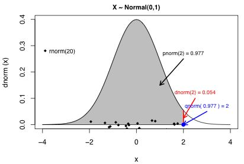
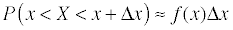

```{r include=FALSE}
library(tidyverse)
```


## Data Types in R (vs. Python)

### Primitives

#### All R primitives are technically vectors

R | Python | Notes
----- | ----- | -----
`character` | Str | 
`complex` | ??? | includes imaginary numbers
`numeric` | Float | 
`integer` | Int | 
`logical` | Bool | 

Function | Description
----- | -----
`is.datatype` | will return TRUE or FALSE
`as.datatype` | will convert from the original datatype to the one specified
`class(x)` | will return the datatype of x
`is.na` | tests for NA (missing) values
`is.null` | tests for NULL values

Can coerce data from lower end without loss of precision to uppper end but not the other way around.

### Non-Primitives

R | Python | Notes
------------- | -------------------------- | --------------------------
`factor` | not available | kinda like Python dictionaries but has levels as well, can be ordered
`date` | datetime | 
`vector`  | list (all same datatype) | all R primitives are technically vectors and can have length.  Values in a vector must be all the same datatype
`list` |  list | 
`matrix` | not available - Maybe with Pandas? | all data must be of the same type
`data.frame` | not available - Need pandas |  Each column can be a different datatype

There is no `is.date` function.

#### Note about factors

The term factor refers to a statistical data type used to store categorical variables. The difference between a categorical variable and a continuous variable is that a categorical variable can belong to a limited number of categories. A continuous variable, on the other hand, can correspond to an infinite number of values.

It is important that R knows whether it is dealing with a continuous or a categorical variable, as the statistical models you will develop in the future treat both types differently.

## Entering Data in R

### Vectors

R Comand | Description
----------------------- | --------------------------------
`x <- 0:10` | Assigns numbers 0 through 10 to x in a vector
`y <- c(1,2,5,3,7,8,4,9,0)` | Assigns the vector to y
`seq(from , to, by)` | generate a sequence<br>indices <- seq(1, 10, 2) <br># indices is c(1, 3, 5, 7, 9)
`rep(x, ntimes)` | repeat x n times<br>y <- rep(1:3, 2) <br># y is c(1, 2, 3, 1, 2, 3)

#### Other Useful Functions for creating and working with Vectors

Function | Description
------------------ | ----------------------------------------
`names(v) <- c('one', 'two', 'three')` | Assigns names to the values in the vector
`names(vector)` | Returns the names of all the values in the vector
`names(v)[3]` | returns the name of the the value in the third index of the vector
`v['one']` | returns the name and the value in the index named one
`v[c("Mon", "Tues", "Wed")]` | returns the name and the value in the indices named "Mon", "Tues", and "Wed"
`length(vector)` | returns the length of the vector
`cut(x, n)` | divide continuous variable in factor with n levels y <- cut(x, 5)

#### Creating a selection vector

```{r}
vector <- c(1, 2, -4, 5, -6)
selection_vector <- vector > 0
selection <- vector[selection_vector]
selection
```

### Factors

To create a factor, first create a vector with all your values, then use the `factor()` function to convert it to a factor.  To set the levels of an ordinal categorical value while you are creating a factor, use `factor(vector, order= TRUE, levels = c("Low", "Medium", "High")`.  To set the levels after the factor is already created, use `levels(factor) <- c("name1", "name2",...)`.  You can also use this to change the names of the levels.  Watch out: the order with which you assign the levels is matters.  Alternatively you can specify the associations like this: `levels(factor) <- c('F' = "Female", 'M' = "Male")`

### Lists

Lists can contain anything!  (Just like Python)

```{r}
# Vector with numerics from 1 up to 10
my_vector <- 1:10 

# Matrix with numerics from 1 up to 9
my_matrix <- matrix(1:9, ncol = 3)

# First 10 elements of the built-in data frame mtcars
my_df <- mtcars[1:10,]

# names are optional but useful!
my_list <- list(vec = my_vector, mat = my_matrix, df = my_df)
my_list
```

Indexing lists in R needs double brackets.

```{r}
my_list[[2]]
```

Other indexing syntax...

```{r}
my_list[["vec"]]
my_list$df
my_list[['df']][2:3,]
```

### Matrices and Data Frames

```{r}
# Dataframes can store vectors of different types
x <- 1:3
y <- 4:6
z <- c('seven', 'eight', 'nine')
df <- data.frame(x, y, z, stringsAsFactors = FALSE)
df
names(df) <- c('one', 'two', 'three')
df
# Matrices must be all of the same type
v <- 7:9
c <- c("one", "two", "three")
mat <- matrix(c(x, y, v), byrow = TRUE, nrow = 3)
mat
mat2 <- matrix(c(c, z), byrow = TRUE, nrow = 2)
mat2
names(mat) <- c('one', 'two', 'three')
mat
```

Function | Description
------------------ | --------------------------------------------
`nrow(dataframe)` | returns the number of rows
`ncol(dataframe)` | returns the number of columns
`str(dataframe)` | returns the structure of the dataframe
`dim(dataframe)` | Returns the dimensions of the dataframe
`head(df, 3)` | returns the first 3 rows of the dataframe
`tail(df, 5)` | returns the last 5 rows of the dataframe
`names(dataframe)` | Returns the names of the columns or variabes in the dataframe
`names(df)[3]` | returns the third column name
`names(df) <- c('one', 'two', 'three')` | Assigns names to the columns in the dataframe or **values** in a matrix
`rownames(matrix_df) <- row_names_vector` | Assigns names to the rows in the matrix/dataframe
`colnames(matrix_df) <- col_names_vector` | Assigns names to the columns in the matrix/dataframe
`rownames(dataframe)` | Returns the names of the rows in the dataframe
`colnames(dataframe)` | Returns the names of the columns in the dataframe
`rownames(df) <- NULL` | resets to generic index names
`colnames(df) <- NULL` | resets to generic names
`rowSums(df)` | Just what it sounds like
`colSums(df)` | Just what it sounds like
`rbind(df, df2)` | combines two dataframes or vectors adding the second one as additional rows to the first
`cbind(df, df2)` | combines two dataframes or vectors adding the second one as additional columns to the first
`dataframe$variable` | Returns all of the values in the specified variable as a ***vector***
`df$totals <- df$var1 + df$var2` | Creates a new column and puts the total of var1 and var2 in that column
`df[which.max(df$var),]` | Finds the row with max in specified variable column

#### Note about multiplying matrices

You can multiply each element in a matrix by te corresponding element in another matirx using regular operations i.e. `matrix1 * matrix2`

This is not the standard matrix multiplication for which you should use `%*%` in R.

### data.table

```{r}
library(data.table, quietly = TRUE)
x <- 1:3
y <- 4:6
z <- c('seven', 'eight', 'nine')
DT <- data.table(x, y, z) # strings are automatically characters not factors
DT
```

data.table 1.10.4.3
  The fastest way to learn (by data.table authors): <https://www.datacamp.com/courses/data-analysis-the-data-table-way>
  Documentation: ?data.table, example(data.table) and browseVignettes("data.table")
  Release notes, videos and slides: <http://r-datatable.com>
  
Accessing data is a little different then data.frame. 

Function | Description
----- | -----
`DT[1:5, ]` | rows 1 - 5
`DT[A>=7, ]` | All rows where column A >= 7
`DT[ , B]` | only column B
`DT[ , list(B, D)]` | only column B and D

## Variables

### Assignment

`x <- 5` or `5 -> x`

`a <- b <- 36`

`assign('y', 42)` 

Variable names can use any conbination of alphanumeric characters, periods and underscores, but they cannot *start* with a number or underscore.

Note - single and double quotes can be used interchangeably like in Python.

### Removing Variables

`remove(var)` or `rm(var)`

## Writing functions and conditional statements

### If Else

```
# If statement alone
if(condition=TRUE){
  code to run
}

# If Else statement
if(condition=TRUE){
  code to run
} else {
  code to run if condition=FALSE
}

# If, Else If, Else statement
if(condition1=TRUE){
  code to run if condtion1=TRUE
} else if(condition2=TRUE){
  code to run if condtion1=FALSE but condition2=TRUE
} else {
  code to run if both conditions=FALSE
}
```

### While Loop

```
while (condition) {
  expr
  increment
}
```

Can nest if statements inside

```
while (condition) {
  if(condition=TRUE){
    expr
  }
  increment
}
```

### For Loop

```
for (var in seq) {
  expr
}
```

```
for (var in seq) {
  if(condition=TRUE){
    next #skips this loop if condition is met
  }
  expr
}
```

### Wrting Custom Functions

```
my_func <- function(arg1, arg2=DEFAULT){
  code
}
```

### lapply()

Use to iterate without a for loop

```
# Can take a list or a vector as input
lapply(iterator, function)
# Always returns a list.

# If you don't want a list, do this...
unlist(lapply(iterator, function))
# Returns a vector

# To use lapply with a function that takes more than one argument
lapply(iterator, function, arg)
```

### sapply()

```
# only use if all items are of the same type.
# returns a named vector (unlists automatically)
sapply(vector, function, USE.NAMES=FALSE)
# USE.NAMES arg to get an unnamed vector
```

If each item returns a list of same length it returns a matrix

If each item returns a list of different lengths it returns a list of lists

## Built-in Functions

This section taken from <https://www.statmethods.net/management/functions.html> with lots of additions by me.

### Getting Started and Finding Help

**Tip:** If you use the up and down arrow keys, you can scroll through your previous commands, your so-called command history. You can also access it by clicking on the history tab in the upper right panel. This will save you a lot of typing in the future.

R Comand | Description
-------------------- | ----------------------------------------
`ctrl + L` | to clear console
`ls()` | list the objects in memory to the console
`library()` | Lists the packages in your library
`search()` | Shows packages that are currently active
`install.package(package_name)` | installs package
`library(package_name)` or <br>`require(package_name)`  | loads package into memory
`?function_name` | Displays the documentation for the function in the viewer window in RStudio
`apropos('func')` | to search for a function by only part of the name
`args(func)` | To get information about the function arguments
`search()` | To see a list of loaded packages (when you load a package you are adding it to your search list)
`getwd()` | get the working directory
`setwd("file\path")` | set the working directory
`vignette(package="package_name")` | To see a list of 'vignettes' or sample code for a package
`vignette("vin_name", package="pack_name")` | to view a specific vignette
`data(package="package_name")$results` | to see the datasets that come with a package
`data(dataset_name)` | to load data - note it does not show up in the "Data" section of your environment in RStudio until you use the data in another function like `head(data)` or `dim(data)`

**Note:** Putting parenthases around your code is equivalent to the print function

### Numeric Functions

Function | Description
--------------- | ----------------------------------------
`+`, `-`, `*`, `/` | addition, subtraction, multiplication, division
`x %% y` | modulo or remainder of division of x by y
`x %/% y` | integer division - number of times y goes into x without remainder
`x ^ y` (or `x ** y`) | exponentiation - x raised to the power y
`abs(x)` | absolute value
`sqrt(x)` | square root
`ceiling(x)` | ceiling(3.475) is 4
`floor(x)` | floor(3.475) is 3
`trunc(x)` | trunc(5.99) is 5
`round(x, digits=n)` | round(3.475, digits=2) is 3.48
`signif(x, digits=n)` | signif(3.475, digits=2) is 3.5
`cos(x)`, sin(x), tan(x) | also acos(x), cosh(x), acosh(x), etc.
`log(x)` | natural logarithm
`log10(x)` | common logarithm
`exp(x)` | e^x

### Logical Operators

Operator | Description
---------- | ---------------------------------------------
`<` | less than
`<=` | less than or equal to
`>` | greater than
`>=` | greater than or equal to
`==` | exactly equal to
`!=` | not equal to
`!x` | Not x
`x | y` | x OR y
`x & y` | x AND y
`x %in% c(a, b, c)` | TRUE if x is in the vector c(a, b, c)
`isTRUE(x)` | test if X is TRUE
`any(v1 < v2)` | checks if any item in a vector is less than the corresponding item in a second vector
`all(v1 < v2)` | checks if all items in a vector are less than the corresponding items in a second vector
`identical(x, y)` | checks if the two items are identical

### Character Functions

Function | Description
--------------- | ----------------------------------------
`nchar(x)` | returns the number of characters in x (works on character and numeric datatypes even withint vectors, will not work on factors)
`toupper(x)` | Uppercase
`tolower(x)` | Lowercase
`substr(x, start=n1, stop=n2)` | Extract or replace substrings in a character vector.<br>x <- "abcdef" <br>substr(x, 2, 4) is "bcd" <br>substr(x, 2, 4) <- "22222" is "a222ef"
`grep(pattern, x , ignore.case=FALSE, fixed=FALSE)` | Search for pattern in x. If fixed=FALSE then pattern is a regular expression. If fixed=TRUE then pattern is a text string. Returns matching indices.<br>grep("A", c("b","A","c"), fixed=TRUE) returns 2
`sub(pattern, replacement, x, ignore.case =FALSE, fixed=FALSE)` | Find pattern in x and replace with replacement text. If fixed=FALSE then pattern is a regular expression.<br>If fixed = T then pattern is a text string. <br>sub("\\s",".","Hello There") returns "Hello.There"
`gsub(pattern, replacement, x)` | Same as sub but replaces all not just first occurance in each item in your list
`strsplit(x, split)` | Split the elements of character vector x at split. 
`strsplit("abc", "")` | returns 3 element vector "a","b","c"<br>
`paste(..., sep="")` | Concatenate strings after using sep string to seperate them.<br>paste("x",1:3,sep="") returns c("x1","x2" "x3")<br>paste("x",1:3,sep="M") returns c("xM1","xM2" "xM3")<br>paste("Today is", date())<br>paste(Year, Month, DayofMonth, sep="-")

### Basic Statistical Functions

Basic statistical functions are provided in the following table. Each has the option na.rm to strip missing values before calculations. Otherwise the presence of missing values will lead to a missing result. Object can be a numeric vector or data frame.

Function | Description
-------------------- | ----------------------------------------
`min(x)` | minimum
`max(x)` | maximum
`sum(x)` | sum
`diff(x)` | difference
`range(x)` | range
`mean(x, trim=0,<br>na.rm=FALSE)` | mean of object x<br># trimmed mean, removing any missing values and <br># 5 percent of highest and lowest scores <br>mx <- mean(x,trim=.05,na.rm=TRUE)
`median(x)` | median
`var(x)` | variance
`sd(x)` | standard deviation of object(x). <br>also look at var(x) for variance and mad(x) for median absolute deviation.
`summary(x)` | Returns Min, Max, 1st Qtr, 3rd Qtr, Median, Mean and num of missing values - N0 SD.  Can be used with factors, but not categorical vectors
`quantile(x, probs)` | quantiles where x is the numeric vector whose quantiles are desired <br>and probs is a numeric vector with probabilities in [0,1].<br># 30th and 84th percentiles of x<br>y <- quantile(x, c(.3,.84))
`fivenum(x)` | min, 1st, 2nd, 3rd Quartiles, and Max
`IQR(x)` | Spread between 25th and 75th percentile
`rank(x)` | takes a group of values and calculates the rank of each value within the group
`diff(range(x))` | total range of vector x
`diff(x, lag=1)` | lagged differences, with lag indicating which lag to use
`scale(x, center=TRUE, scale=TRUE)` | 	column center or standardize a matrix.

**NOTE:** adding `na.rm=TRUE` will ignore missing values in most functions above

### Statistical Probability Functions

The following table describes functions related to probaility distributions. For random number generators below, you can use set.seed(1234) or some other integer to create reproducible pseudo-random numbers.

Function | Description
-------------------- | ----------------------------------------
`dnorm(x)` | normal density function (by default m=0 sd=1)<br># plot standard normal curve<br>x <- pretty(c(-3,3), 30)<br>y <- dnorm(x)<br>plot(x, y, type='l', xlab="Normal Deviate", ylab="Density", yaxs="i")
`pnorm(q)` | cumulative normal probability for q <br>(area under the normal curve to the left of q)<br>pnorm(1.96) is 0.975
`qnorm(p)` | normal quantile. <br>value at the p percentile of normal distribution <br>qnorm(.9) is 1.28 # 90th percentile 
`rnorm(n, m=0,sd=1)` | n random normal deviates with mean m and standard deviation sd. <br># 50 random normal variates with mean=50, sd=10<br>x <- rnorm(50, m=50, sd=10)
`dbinom(x, size, prob)`<br>`pbinom(q, size, prob)`<br>`qbinom(p, size, prob)`<br>`rbinom(n, size, prob)` | binomial distribution where size is the sample size and prob is the probability of a heads (pi) <br># prob of 0 to 5 heads of fair coin out of 10 flips<br>dbinom(0:5, 10, .5)<br># prob of 5 or less heads of fair coin out of 10 flips
`pbinom(5, 10, .5)`<br>`dpois(x, lamda)`<br>`ppois(q, lamda)`<br>`qpois(p, lamda)<br>rpois(n, lamda)` | poisson distribution with m=std=lamda<br># probability of 0,1, or 2 events with lamda=4<br>dpois(0:2, 4)<br># probability of at least 3 events with lamda=4 <br>1- ppois(2,4)
`dunif(x, min=0, max=1)`<br>`punif(q, min=0, max=1)`<br>`qunif(p, min=0, max=1)`<br>`runif(n, min=0, max=1)` | uniform distribution, follows the same pattern as the normal distribution above. <br># 10 uniform random variates<br>x <- runif(10)

Note that while the examples on this page apply functions to individual variables, many can be applied to vectors and matrices as well.


#### The R probability functions

<https://www.unc.edu/courses/2008fall/ecol/563/001/images/lectures/lecture3/lecture3.htm#probfunc>



There are four basic probability functions for each probability distribution in R. R's probability functions begins with one of four prefixes: d, p, q, or r followed by a root name that identifies the probability distribution. For the normal distribution the root name is "norm". The meaning of these prefixes is as follows.

  - **d** is for "density" and the corresponding function returns the value from the probability density function (continuous) or probability mass function (discrete).
  - **p** is for "probability" and the corresponding function returns a value from the cumulative distribution function.
  - **q** is for "quantile" and the corresponding function returns a value from the inverse cumulative distribution function.
  - **r** is for "random and the corresponding function returns a value drawn randomly from the given distribution.
  
To better understand what these functions do we'll focus on the four probability functions for the normal distribution: dnorm, pnorm, qnorm, and rnorm. Fig. 3 illustrates the defining relationships among these four functions.

  - **dnorm** is the normal probability density function. Without any further arguments it returns the density of the standard normal distribution. If you plot dnorm(x) over a range of x-values you obtain the usual bell-shaped curve of the normal distribution. In Fig. 3, the value of dnorm(2) is indicated by the height of the vertical red line segment. It's the just the y-coordinate of the normal curve when x = 2. Keep in mind that density values are not probabilities. To obtain probabilities one needs to integrate the density function over an interval. Alternatively if we consider a very small interval, say one of width ??x, and if f(x) is a probability density function, then it is the case that 
  - **pnorm** is the cumulative distribution function for the normal distribution. By definition pnorm(x) = P(X ??? x) and is the area under the normal density curve to the left of x. Fig. 3 shows pnorm(2), the area under the normal density curve to the left of x = 2. As is indicated on the figure, this area is 0.977. So the probability that a standard normal random variate takes on a value less than or equal to 2 is 0.977
  - **qnorm** is the quantile function of the standard normal distribution. If qnorm(x) = k then k is the value such that P(X ??? k) = x . qnorm is the inverse function for pnorm. From Fig. 3 we have, qnorm(0.977) = qnorm(pnorm(2)) = 2.
  - **rnorm** generates random values from a standard normal distribution. The required argument is a number specifying the number of normal variates to produce. Fig. 3 illustrates rnorm(20), the locations of 20 random realizations from the standard normal distribution, jittered slightly to prevent overlap.

### Creating Tables and Graphs

Function | Description
-------------------- | ----------------------------------------
`table(df$var1, useNA='ifany')` | Creates a table of sums of each value for the variable
`table(df$var1, df$var2, useNA='ifany')` | Creates a table of sums of the inersection of the two variables
`prop.table(table(df$var))` | Creates a table of the proportion of each value for the variable
`barplot(table(df$var), las=3)` | Creates a bargraph of the values of the variable
`plot(x = df$var1, y = df$var2)` | Creates a scatterplot of the two variables<br> Technically you don't need the x= and y= as long as you put them first and in that order because by default the first 2 arguments are for the x and y variables
`plot(df$var1, df$var2, type = "l")` | Creates a linegraph of the two variables
`hist(x)` | Creates a histogram of the single variable x

## Reading data into R

### From CSV

`read.csv("file/location", header = F)`

Must use double backslash or forward slashes.

`header = F` means the original file has no header

### From SPSS

Use Foreign Package

```
install.packages("foreign")
library(foreign)
df <- read.spss("file/location", to.data.frame=T, use.value.labels=T)
```

### From GitHub

Here is some sample code for reading R from a dataset that has been posted in a GitHub repository:

```
library(RCurl) 
x <- getURL("https://raw.github.com/aronlindberg/latent_growth_classes/master/LGC_data.csv") 
y <- read.csv(text = x)
```

source: <http://stackoverflow.com/questions/14441729/read-a-csv-from-github-into-r>

**Make sure you copy the RAW data URL location.**

## Generating Random Numbers

For uniformly distributed (flat) random numbers, use runif(). By default, its range is from 0 to 1.

```
runif(1)
#> [1] 0.09006613

# Get a vector of 4 numbers
runif(4)
#> [1] 0.6972299 0.9505426 0.8297167 0.9779939

# Get a vector of 3 numbers from 0 to 100
runif(3, min=0, max=100)
#> [1] 83.702278  3.062253  5.388360

# Get 3 integers from 0 to 100
# Use max=101 because it will never actually equal 101
floor(runif(3, min=0, max=101))
#> [1] 11 67  1

# This will do the same thing
sample(1:100, 3, replace=TRUE)
#> [1]  8 63 64

# To generate integers WITHOUT replacement:
sample(1:100, 3, replace=FALSE)
#> [1] 76 25 52
```

To generate numbers from a normal distribution, use rnorm(). By default the mean is 0 and the standard deviation is 1.

```
rnorm(4)
#> [1] -2.3308287 -0.9073857 -0.7638332 -0.2193786

# Use a different mean and standard deviation
rnorm(4, mean=50, sd=10)
#> [1] 59.20927 40.12440 44.58840 41.97056

# To check that the distribution looks right, make a histogram of the numbers
x <- rnorm(400, mean=50, sd=10)
hist(x)
```

If you want to generate a sequence of random numbers, and then generate that same sequence again later, use set.seed(), and pass in a number as the seed.

```
set.seed(423)
runif(3)
#> [1] 0.1089715 0.5973455 0.9726307

set.seed(423)
runif(3)
#> [1] 0.1089715 0.5973455 0.9726307
```

## Random Samples

Use the sample( ) function to take a random sample of size n from a dataset.

```
# take a random sample of size 50 from a dataset mydata 
# sample without replacement
mysample <- mydata[sample(1:nrow(mydata), 50,
  	replace=FALSE),]
```

## Measuring elapsed time

The system.time() function will measure how long it takes to run a particular block of code in R.

```
system.time({
    # Do something that takes time
    x <- 1:100000
    for (i in seq_along(x))  x[i] <- x[i]+1
})
#>    user  system elapsed 
#>   0.144   0.002   0.153
```

The output means it took 0.153 seconds to run the block of code.

## Subsetting Data

R has powerful indexing features for accessing object elements. These features can be used to select and exclude variables and observations. The following code snippets demonstrate ways to keep or delete variables and observations and to take random samples from a dataset.

### Selecting (Keeping) Variables 

```
# select variables v1, v2, v3
myvars <- c("v1", "v2", "v3")
newdata <- mydata[myvars]

# another method same as above
myvars <- paste("v", 1:3, sep="")
newdata <- mydata[myvars]

# select 1st and 5th thru 10th variables
newdata <- mydata[c(1,5:10)]
```

To practice this interactively, try the [selection of data frame elements exercises](https://campus.datacamp.com/courses/free-introduction-to-r/chapter-5-data-frames?ex=6) in the Data frames chapter of this [introduction to R course](https://www.datacamp.com/courses/free-introduction-to-r).

### Excluding (DROPPING) Variables

```
# exclude variables v1, v2, v3
myvars <- names(mydata) %in% c("v1", "v2", "v3") 
newdata <- mydata[!myvars]

# exclude 3rd and 5th variable 
newdata <- mydata[c(-3,-5)]

# delete variables v3 and v5
mydata$v3 <- mydata$v5 <- NULL
```

### Selecting Observations in a data.frame

```
# first 5 observations
newdata <- mydata[1:5, ]

# first 5 variables/columns
newdata <- mydata[ ,1:5]

# row 2 column 6
newdata <- mydata[2,6]

# row 2 and 4 column 6
newdata <- mydata[c(2,4),6]

# based on variable values
# which same as where clause in SQL
newdata <- mydata[ which(mydata$gender=='F' 
& mydata$age > 65), ]

# or
attach(mydata)
newdata <- mydata[ which(gender=='F' & age > 65),]
detach(mydata)

# with allows us to specify the columns of a data.frame without having to specify the data.frame name each time...
baseball$OBP <- with(baseball, (h + bb + hbp) / (ab + bb + hbp + sf))
```

### Selection using the Subset Function
The subset( ) function is the easiest way to select variables and observations. In the following example, we select all rows that have a value of age greater than or equal to 20 or age less then 10. We keep the ID and Weight columns.

```
# using subset function 
newdata <- subset(mydata, age >= 20 | age < 10, 
select=c(ID, Weight))
```

In the next example, we select all men over the age of 25 and we keep variables weight through income (weight, income and all columns between them).

```
# using subset function (part 2)
newdata <- subset(mydata, sex=="m" & age > 25,
select=weight:income)
```

**Note:** Column names do not need quotes, but values do.

### Aggragting Data

```
aggregate(var ~ group_by-var, data, function)
# to group by more than one variable, separate with a + sign
aggregate(price ~ cut + color, diamonds, mean, na.rm=TRUE)

# to aggregate by more than one variable, use cbind()
aggregate(cbind(price, carat) ~ cut, diamonds, mean, na.rm=TRUE)
```

Keep in mind that *plyr*, *dplyr*, and *data.table* are faster.

### Ordering Data

```
# returns a vecor of index postions
order(data$var, decreasing=TRUE)
```

# tidyverse

## tidyr

### gather()

### spread()

### separate()

### unite()

## dplyr

Dplyr does not change the original dataset.

Convert a dataframe into a tbl (tibble)

```
df <- tbl_df(df)
```

See structure but better than str()!

```
glimpse(df)
```

Use a lookup table to convert codes to values

```
# The lookup table
lut <- c("A" = "carrier", "B" = "weather", "C" = "FFA", "D" = "security", "E" = "not cancelled")

# Add the Code column
hflights$Code <- lut[hflights$CancellationCode]
```

### select()

Returns a subset of the columns. Variable names do not need quotes.

```
select(df, col1, col2, col3, ...)
```

#### Helper functions for variable selection
dplyr comes with a set of helper functions that can help you select groups of variables inside a `select()` call:

Function | Description
----------------------- | -----------------------
`starts_with("X")` | every name that starts with "X",
`ends_with("X")` | every name that ends with "X",
`contains("X")` | every name that contains "X",
`matches("X")` | every name that matches "X", where "X" can be a regular expression,
`num_range("x", 1:5)` | the variables named x01, x02, x03, x04 and x05,
`one_of(x)` | every name that appears in x, which should be a character vector.

Pay attention here: When you refer to columns directly inside select(), you don't use quotes. If you use the helper functions, you do use quotes.

### filter() 

Returns a subset of the rows.

```
# filters df so that only the observations for which col1 is equal to 1 are kept
filter(df, col1 == 1, col2 != 1)
```

Boolean operators can be used to combine multiple logical tests into a single test. These include & (and), | (or), and ! (not). Instead of using the & operator, you can also pass several logical tests to filter(), separated by commas. 

```
# Exactly the same output
filter(df, a > 0 & b > 0)
filter(df, a > 0, b > 0)
```

To keep the observations for which the variable x is not NA:

```
filter(df, !is.na(x))
```

***Don't forget to use the double equal sign!***

### mutate()

Adds new variables(columns) that are functions of existing variables.

```
# Adds a new column x that is a function of y and z
mutate(df, x = y - z)

# Adds a new column x that is a function of y and z
# and second new column a that is a function of b and c
mutate(df, x = y - z, a = b + c)
```

### arrange() 

Reorders the rows according to single or multiple variables.

Ascending by default

```
# first by var1 asc 
# then by var2 desc, 
# then by the sum of x and y
arrange(df, var1, desc(var2), x + y)

```

### summarise() 

Condenses multiple values to a single value. Reduces each group to a single row by calculating aggregate measures.

```
summarise(df, min = min(x), avg = mean(y))
```

#### dplyr aggregate functions

dplyr provides several helpful aggregate functions of its own, in addition to the ones that are already defined in R. These include:

Function | Description
----------------------- | -----------------------
`first(x)` | The first element of vector x.
`last(x)` | The last element of vector x.
`nth(x, n)` | The nth element of vector x.
`n()` | The number of rows in the data.frame or group of observations that summarise() describes.
`n_distinct(x)` | The number of unique values in vector x.

Next to these dplyr-specific functions, you can also turn a logical test into an aggregating function with `sum()` or `mean()`. A logical test returns a vector of `TRUE`'s and `FALSE`'s. When you apply `sum()` or `mean()` to such a vector, R coerces each `TRUE` to a 1 and each `FALSE` to a 0. `sum()` then represents the total number of observations that passed the test; `mean()` represents the proportion.

```{r}
mpg2 <- (mtcars$mpg > 20)
mpg2
# number and proportion of cars that get greater than 20 mpg
summarise(mtcars, tot = n(), num = sum(mpg2), avg = mean(mpg2))
```

### Pipes

Pipes require the *magrittr* or *dplyr* package.

`x %>% mean(na.rm=TRUE)` passes the x variable in to the first argument in the mean function

can be chained together `z %>% is.na %>% sum`

```
hflights %>%
  mutate(diff =  TaxiOut - TaxiIn) %>%
  filter(!is.na(diff)) %>%
  summarise(avg = mean(diff))
```

### group_by() 

Most useful when using `summarise()` after grouping.

```{r}
mtcars %>%
  group_by(cyl) %>%
  summarise(avg_mpg = mean(mpg))
```

### Putting it all together!

```
hflights %>%
  group_by(TailNum) %>%
  summarise(num = n_distinct(Dest)) %>%
  filter(num == 1) %>%
  summarise(nplanes = n())

# Find the most visited destination for each carrier
hflights %>%
  group_by(UniqueCarrier, Dest) %>%
  summarise(n = n()) %>%
  mutate(rank = rank(desc(n))) %>%
  filter(rank == 1)
```

### sample_n() and sample_frac() 

to display random samples from your data.

```{r}
# display exactly 5 random rows
sample_n(mtcars, 5, replace = FALSE)
# display 5 percent of your data rows selected at random
sample_frac(mtcars, 0.05, replace = FALSE)
```

### rename()

### transmute()

### Connecting dplyr to a data table or database

to save data as a data table

```
library(data.table)
hflights2 <- as.data.table(hflights)
```

## ggplot2
